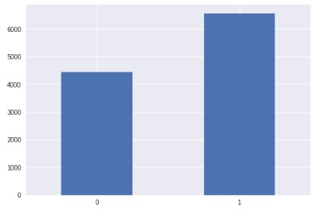
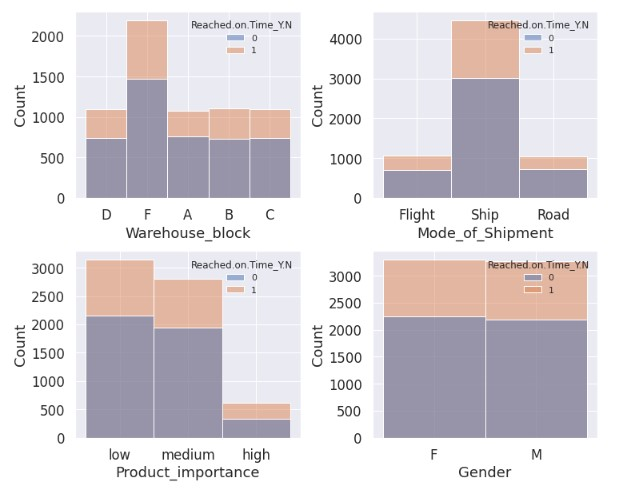
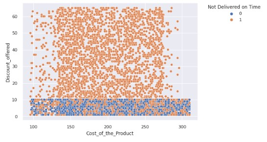
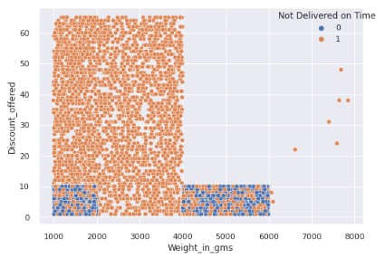
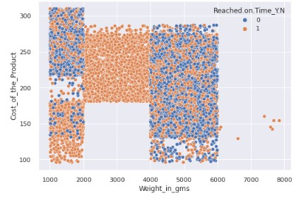
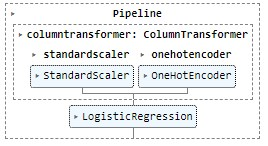

# Classification for Products will arrive late for Ecommerce Company

## Data analysis including exploratory analysis, data viz and predictions using Classification Models

### Author Jose Herrera

### Business Problem

Determine which products will arrive late

### Data
Data provided by Kaggle  
(10999, 12) obs  
dtypes: int64(8), object(4)

## Methods

First part of the analysis is data manipulation and exploration analysis including data viz  

Second part of the analysis is creating the prediction models.  

* Transformers Used
  * For numerical features
    * Standard scaler
  * For categorical features
    * Hot Enconder

* 3 Prediction Models
  * Logistic Regression
  * KNN
  * XGBoost
* Same models were tested with PCA
 
 
## Results
Exploratory Analysis

**Classes Balance**

1 are products that DID arrive late

 
 
 **Categorical Features vs Target**
 
  
 
  Barplots above shows that for the categorical variables there is no visible relation between those features and the target, given that in all graphs relation between products on time and late stays the same
 
  **Relation between Weight, Cost and Discount**
|Discount vs Cost (1) | Discount vs Weight (2) | Cost vs Weight (3) |
| ------------- |:-------------:|:-------------:|
|       |    |      |
  
Graph 1 above shows some interesting patterns. All the products delivered on time have discount of 10$ or less and have a weight between 1kg and 2kg or between 4kg and 6kg.

Graph 2 shows that all the products that arrive on time had a discount lower than 10$ and the cost of the product didn't matter to be delivered on time or not.

Analyzing Graph 3, it can be notice that:
All the products that arrive on time are between 1kg and 2kg and between 4kg and 6kg.
All the products between 2kg and 4kg did not arrive on time.
The highest avg cost of products is for the ones that weight between 2kg and 4kg

  
## Model
The model selected is a Logistic Regression. The metric used to select the model was Recall.
Using recall means that the models is avoiding False negatives.

|Recall | 0.8509 | 
| ------------- |:-------------:|
| Accuracy    |0.6240

## Recommendations

* Try to use other machine learning models such as Random Forest or maybe other boosting models
* Perform a cost analysis of On Time vs Late products to determine right treshold of the model or change the metric used to select the model.

Analyze predictions to determine how maximize sales based in the current features.  

Deeper analysis of features that may not be correlated to the model can be done to simplify the model.

## Limitations & Next Steps
Due to the scope of the project only 2 models were tested. Using other models the predictions may be better
